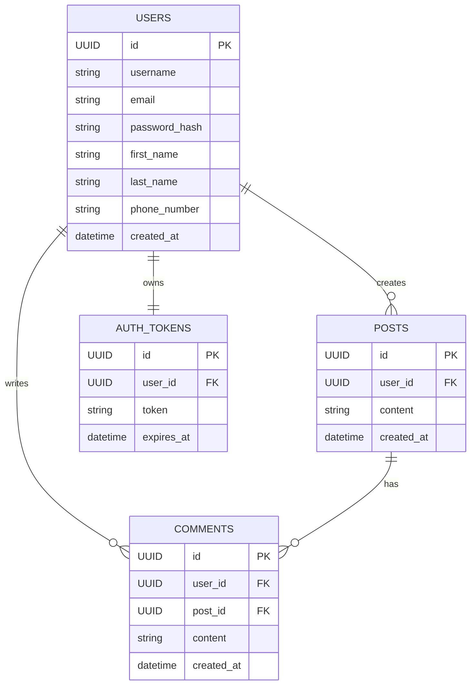

## 🗂 Entity Relationship Diagram (ERD)

Below is a high-level representation of the database schema used by this API. It models the relationships between users, posts, comments, and authentication mechanisms.

